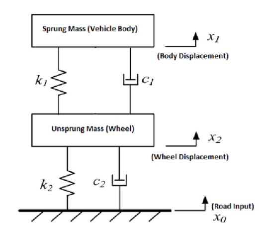
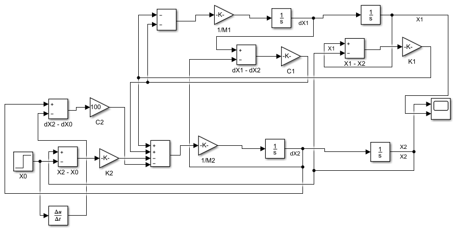
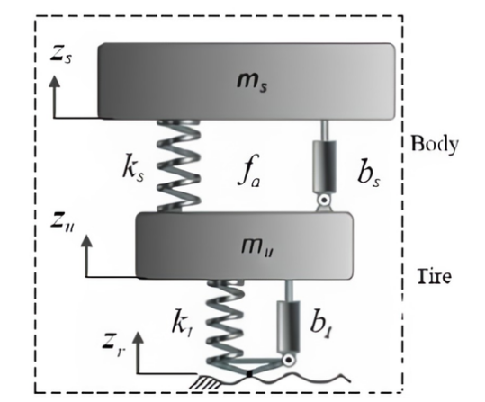
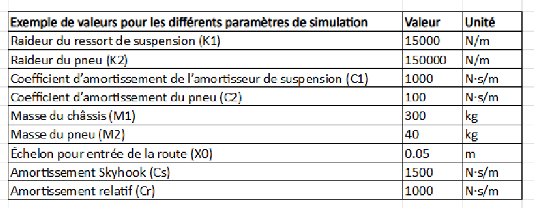
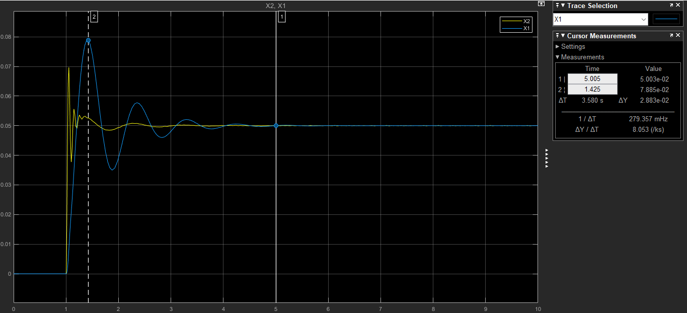
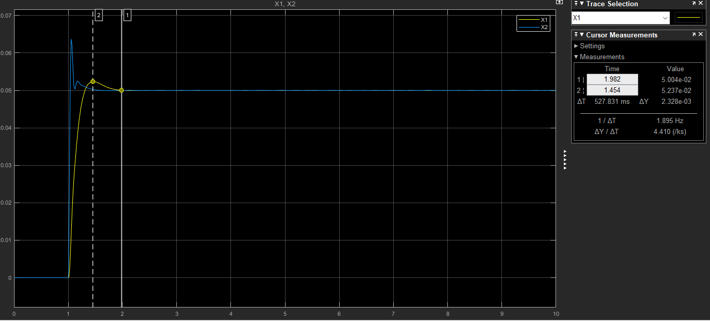

# SYSTÈMES DE SUSPENSION PASSIVE, SEMI-ACTIVE (SKYHOOK) ET ACTIVE (SKYHOOK + LQR)  
Modélisation et simulation d’un quart de véhicule sous MATLAB/Simulink

Ce dépôt contient l’ensemble des modèles, équations, figures et résultats de simulation liés à l’étude comparative de trois architectures de suspension automobile : passive, semi-active commandée par Skyhook, et active commandée par une stratégie hybride (Skyhook + LQR).  
Les modèles sont réalisés sous MATLAB/Simulink et reposent sur un modèle à quart de véhicule (2DDL), suivant la littérature spécialisée et les ressources académiques de référence (Sammier, thèses et travaux institutionnels sur la dynamique verticale du véhicule).

---

## 1. Présentation générale

L’objectif de ce projet est l’analyse, la modélisation et la comparaison des performances dynamiques de trois systèmes de suspension :

- Suspension passive  
- Suspension semi-active (commande Skyhook)  
- Suspension active (Skyhook étendu + commande LQR)

Le modèle utilisé représente un quart de véhicule composé d’une masse suspendue, d’une masse non suspendue, d’un ressort, d’un amortisseur et éventuellement d’un actionneur.

---

## 2. Objectifs du projet

- Comparer les réponses temporelles pour une même excitation route.  
- Évaluer le confort (accélération de la masse suspendue).  
- Examiner la tenue de route (dynamique de la masse non suspendue).  
- Étudier l'apport des stratégies Skyhook et LQR.  
- Démontrer l’intérêt des suspensions actives.

### Modèles Simulink

| Fichier Simulink | Description |
|------------------|-------------|
| `quart_vehicule_suspension_passive.slx` | Modèle 2DDL de la suspension passive |
| `quart_vehicule_suspension_semi_active.slx` | Modèle avec amortissement contrôlé (Skyhook) |
| `quart_vehicule_suspension_active.slx` | Modèle avec actionneur (Skyhook + LQR) |

---

## 3. Modélisation théorique

### 3.1. Suspension passive
La suspension passive, constituée d’un ressort supportant la charge et d’un amortisseur dissipant l’énergie des oscillations, est modélisée par un quart de véhicule à deux degrés de liberté (2DDL), où la masse suspendue représente le châssis et la masse non suspendue la roue. 

Les équations du mouvement, dérivées de la deuxième loi de Newton, intègrent les forces du ressort et de l’amortisseur ainsi que l’excitation de la route, permettant d’évaluer à la fois le confort (accélérations du châssis) et la tenue de route (contact roue-sol).

  

Le schéma en bloc obtenu à l’aide du Simulink :
 

---

### 3.2. Suspension semi-active (Skyhook)
La suspension semi-active améliore le confort et la stabilité en adaptant dynamiquement l’amortissement selon les conditions de conduite, contrairement à la suspension passive fixe. 
Son modèle intègre des ressorts, des amortisseurs et un dispositif de contrôle, et utilise des équations différentielles pour décrire la dynamique du véhicule. 
Des contrôleurs, tels que des algorithmes optimaux ou adaptatifs, déterminent les réglages d’amortissement les plus efficaces en fonction des conditions.

La suspension semi-active ajuste dynamiquement l’amortissement selon une loi Skyhook :

\[Fa = Cs.dx1\]

  
où :
Cs (Amortissement Skyhook) : contrôle l'amortissement en fonction de la vitesse absolue du châssis pour améliorer le confort.
Fa : la force d'amortissement liée à la vitesse du châssis par rapport à un "ancre" fixe (Skyhook). Il aide à réduire les oscillations en s'opposant au mouvement du châssis seul, indépendamment de la roue.

Le schéma en bloc obtenu à l’aide du Simulink :
 

---

### 3.3. Suspension active (Skyhook + LQR)
La suspension active combine mécanique et contrôle en temps réel, intégrant masses suspendues, ressorts, amortisseurs et actionneurs capables de générer des forces contrôlées. Un régulateur, basé sur des stratégies optimales ou adaptatives, ajuste les forces via les actionneurs en fonction des mesures de déplacement et de vitesse, afin de réduire les vibrations et d’améliorer la stabilité du véhicule.
Son comportement est décrit par des équations différentielles pour les masses suspendues et non suspendues. 

Nous utilisons la commande Skyhook étendue pour modéliser et contrôler la force des actionneurs et l’algorithme de LQR pour avoir la valeur du gain pour l’expression de Fa.

---

## 4. Simulation et analyse

Les valeurs des paramètres proviennent de travaux académiques et notamment de la thèse de Damien Sammier.

---

### 4.1. Résultats – Suspension passive

  

---

### 4.2. Résultats – Suspension semi-active

  

---

### 4.3. Résultats – Suspension active

  
 
---

### 4.4 Analyse des résultats

L’analyse graphique met en évidence l’apport déterminant de la suspension active par rapport à la suspension passive. Les résultats montrent une réduction des vibrations de 91,9 %, traduisant une nette amélioration du confort et de la stabilité. Le temps d’amortissement diminue de 85,1 %, ce qui confirme une capacité accrue à dissiper rapidement l’énergie vibratoire. Enfin, la vitesse de réponse est environ 6,7 fois plus élevée, démontrant une réactivité supérieure du système actif face aux irrégularités de la route. L’ensemble de ces indicateurs confirme la supériorité fonctionnelle de la suspension active dans les conditions étudiées.

