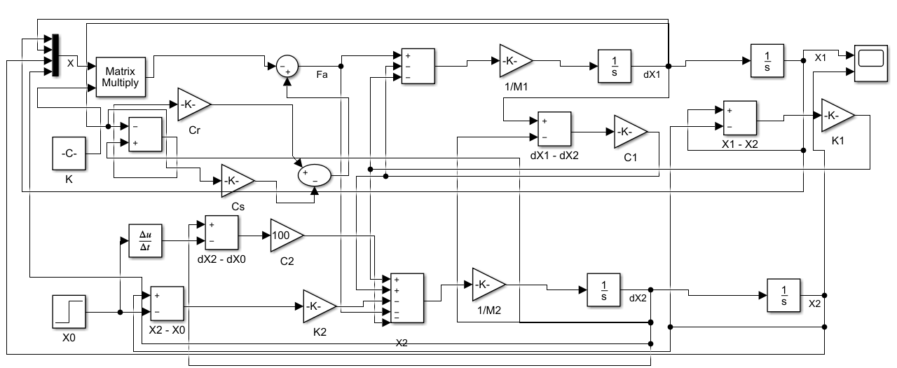

# SYSTÈMES DE SUSPENSION PASSIVE, SEMI-ACTIVE (SKYHOOK) ET ACTIVE (SKYHOOK + LQR)  
Modélisation et simulation d’un quart de véhicule sous MATLAB/Simulink

Ce dépôt contient l’ensemble des modèles, équations, figures et résultats de simulation liés à l’étude comparative de trois architectures de suspension automobile : passive, semi-active commandée par Skyhook, et active commandée par une stratégie hybride (Skyhook + LQR).  
Les modèles sont réalisés sous MATLAB/Simulink et reposent sur un modèle à quart de véhicule (2DDL), suivant la littérature spécialisée et les ressources académiques de référence (Sammier, thèses et travaux institutionnels sur la dynamique verticale du véhicule).

---

## 1. Présentation générale

L’objectif de ce projet est l’analyse, la modélisation et la comparaison des performances dynamiques de trois systèmes de suspension :

- Suspension passive  
- Suspension semi-active (commande Skyhook)  
- Suspension active (Skyhook étendu + commande LQR)

Le modèle utilisé représente un quart de véhicule composé d’une masse suspendue, d’une masse non suspendue, d’un ressort, d’un amortisseur et éventuellement d’un actionneur.

---

## 2. Structure du dépôt

### Modèles Simulink

| Fichier Simulink | Description |
|------------------|-------------|
| `quart_vehicule_suspension_passive.slx` | Modèle 2DDL de la suspension passive |
| `quart_vehicule_suspension_semi_active.slx` | Modèle avec amortissement contrôlé (Skyhook) |
| `quart_vehicule_suspension_active.slx` | Modèle avec actionneur (Skyhook + LQR) |

### Figures – Équations – Modèles

#### Équations de la suspension passive  

#### Modèle passif  

#### Équations de la suspension semi-active  

#### Modèle semi-actif  

#### Équations de la suspension active  

#### Paramètres du modèle  

---

## 3. Modélisation théorique

### 3.1. Suspension passive

La suspension passive repose sur un système ressort–amortisseur.  
Le modèle 2DDL comprend : masses \(m_1,m_2\), raideurs \(k_1,k_2\), amortissements \(c_1,c_2\) et l’entrée route \(x_0\).

  

---

### 3.2. Suspension semi-active (Skyhook)

La suspension semi-active ajuste dynamiquement l’amortissement selon une loi Skyhook :

\[
F_a = C_s \dot{x}_1
\]

  

---

### 3.3. Suspension active (Skyhook + LQR)

La suspension active inclut un actionneur contrôlé par :

\[
F_a = C_r(\dot{x}_1 - \dot{x}_2) - K X
\]

---

## 4. Simulation et analyse

Les valeurs des paramètres proviennent de travaux académiques et notamment de la thèse de Damien Sammier.

---

### 4.1. Résultats – Suspension passive

  
  

---

### 4.2. Résultats – Suspension semi-active

  
  

---

### 4.3. Résultats – Suspension active

  
  

---

## 5. Contenu complémentaire du dépôt

  
  
  
  

---

## 6. Objectifs du projet

- Comparer les réponses temporelles pour une même excitation route.  
- Évaluer le confort (accélération de la masse suspendue).  
- Examiner la tenue de route (dynamique de la masse non suspendue).  
- Étudier l'apport des stratégies Skyhook et LQR.  
- Démontrer l’intérêt des suspensions actives.

---

## 7. Références principales

- Damien Sammier, *Sur la modélisation et la commande de suspension de véhicules automobiles* (thèse).  
- Ouvrages spécialisés et articles de recherche sur la dynamique verticale des véhicules, Skyhook, LQR et suspensions actives.  
- Publications institutionnelles et rapports techniques sur les systèmes de suspension.

